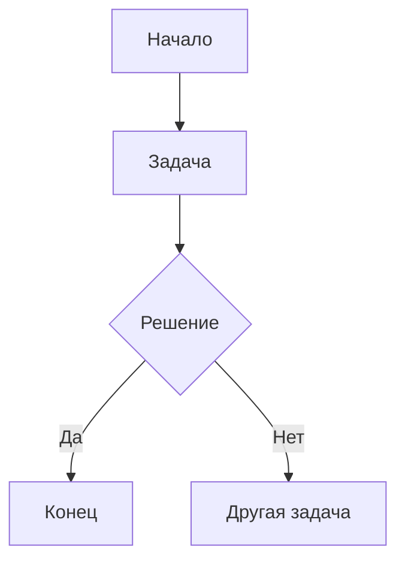

# 📊 BPMN Process Viewer

> Современный веб-просмотрщик BPMN диаграмм для визуализации и анализа бизнес-процессов

[](https://vercel.com/import/project?template=https://github.com/vasilievyakov/bpmn-process-viewer)
[](https://vasilievyakov.github.io/bpmn-process-viewer/)
[](https://www.omg.org/spec/BPMN/2.0/)

## 🎯 О проекте

Этот проект содержит полную **BPMN 2.0 схему процесса разработки продукта** от идеи до эксплуатации, а также современное веб-приложение для её интерактивного просмотра.

## 📋 Описание

Схема описывает полный жизненный цикл разработки продукта, включающий 6 основных фаз:

1. **Инициирование и Определение Концепции**
2. **Планирование Проекта и Детализация Требований**
3. **Проектирование и Разработка**
4. **Тестирование и Обеспечение Качества**
5. **Развертывание и Выпуск**
6. **Эксплуатация, Поддержка и Мониторинг**

## 🎯 Участники процесса

Схема включает 5 основных пулов участников:

- **Бизнес / Спонсор** - инициация идей, маркетинг
- **Управление Продуктом и Аналитика** - PO/PM, BA
- **Управление Проектом** - Project Manager
- **Разработка и Качество** - Архитекторы, Разработчики, QA
- **Эксплуатация и Поддержка** - DevOps, Support Team

## ✨ Возможности веб-приложения

🖥️ **Интерактивный просмотрщик BPMN диаграмм**
- Полная поддержка BPMN 2.0 стандарта
- Интерактивное масштабирование и навигация
- Скачивание диаграмм в формате SVG
- Адаптивный дизайн для всех устройств

🚀 **Современные технологии**
- Vanilla JavaScript (без фреймворков)
- CSS Grid и Flexbox для адаптивности
- BPMN.js для рендеринга диаграмм
- Автоматический деплой на Vercel и GitHub Pages

## 📁 Структура проекта

```
📦 bpmn-process-viewer/
├── 📄 index.html                              # Главная страница
├── 🎨 style.css                               # Стили приложения  
├── ⚡ script.js                               # JavaScript логика
├── 📦 package.json                            # Зависимости проекта
├── ⚙️ vercel.json                             # Конфигурация Vercel
├── 📊 product_development_process_v2.bpmn     # Основная BPMN схема
├── 📊 product_development_process.bpmn        # Расширенная версия
├── 📖 comparison_mermaid.md                   # Сравнение BPMN vs Mermaid
├── 🚀 SETUP.md                                # Инструкция по настройке
├── 🤖 .github/workflows/deploy.yml            # GitHub Actions
└── 📝 README.md                               # Документация
```

## 🚀 Быстрый старт

### Просмотр онлайн
- **GitHub Pages**: [https://vasilievyakov.github.io/bpmn-process-viewer/](https://vasilievyakov.github.io/bpmn-process-viewer/)
- **Vercel**: [https://ваш-проект.vercel.app](https://ваш-проект.vercel.app)

### Локальная разработка
```bash
# Клонирование репозитория
git clone https://github.com/vasilievyakov/bpmn-process-viewer.git
cd bpmn-process-viewer

# Установка зависимостей
npm install

# Запуск локального сервера
npm run dev
# Откройте http://localhost:3000
```

### Деплой в один клик
[](https://vercel.com/import/project?template=https://github.com/vasilievyakov/bpmn-process-viewer)

## 🛠️ Как использовать BPMN файлы

### Способ 1: Онлайн редакторы

**bpmn.io (Рекомендуется)**
1. Перейдите на https://demo.bpmn.io/
2. Нажмите "Open File" или перетащите `.bpmn` файл в браузер
3. Схема автоматически откроется для просмотра и редактирования

**draw.io (diagrams.net)**
1. Откройте https://app.diagrams.net/
2. Выберите "Open Existing Diagram"
3. Загрузите `.bpmn` файл

### Способ 2: Настольные приложения

**Bizagi Modeler**
1. Скачайте Bizagi Modeler (бесплатно)
2. File → Open → выберите `.bpmn` файл

**Camunda Modeler**
1. Скачайте Camunda Modeler
2. File → Open → выберите `.bpmn` файл

**Visual Studio Code**
1. Установите расширение "BPMN Editor"
2. Откройте `.bpmn` файл в VS Code

### Способ 3: Просмотр в браузере через GitHub

GitHub автоматически отображает BPMN файлы в виде диаграмм при просмотре в репозитории.

## ⚖️ BPMN vs Mermaid: Ключевые различия

### BPMN 2.0 (XML) ✅

**Преимущества:**
- Полная поддержка стандарта BPMN 2.0
- Специализированные элементы: пулы, дорожки, потоки сообщений
- Поддержка всех типов шлюзов (XOR, AND, OR)
- Исполняемые процессы (executable processes)
- Интеграция с BPM системами (Camunda, jBPM, etc.)
- Стандартизированная нотация для бизнес-процессов

**Элементы BPMN:**
```xml
<bpmn:task id="Task_1" name="Разработка Функционала" />
<bpmn:exclusiveGateway id="Gateway_1" name="Найдены дефекты?" />
<bpmn:messageFlow id="Flow_1" sourceRef="DevTeam" targetRef="QA" />
<bpmn:participant id="Pool_1" name="Команда Разработки" />
```

### Mermaid ❌

**Ограничения для BPMN:**
- Простые блок-схемы без специфики BPMN
- Нет пулов и дорожек участников
- Нет потоков сообщений между участниками
- Ограниченная поддержка типов шлюзов
- Не поддерживает исполняемые процессы

**Пример Mermaid (НЕ BPMN):**


## 🔧 Редактирование схемы

Для модификации схемы рекомендуется:

1. Использовать специализированные BPMN редакторы (bpmn.io, Bizagi)
2. Сохранять изменения в формате BPMN 2.0 XML
3. Проверять валидность через онлайн валидаторы

## 📊 Ключевые элементы схемы

### События (Events)
- `startEvent` - Поступление бизнес-идеи
- `endEvent` - Выпуск продукта / стабильная эксплуатация

### Задачи (Tasks)
- Определение концепции
- Анализ требований
- Разработка функционала
- Тестирование
- Развертывание

### Шлюзы (Gateways)
- **Exclusive (XOR)** - Утверждение бизнес-кейса, обнаружение дефектов
- **Parallel (AND)** - Синхронизация архитектуры и планирования

### Потоки сообщений (Message Flows)
- Между пулами участников
- Передача артефактов и решений

## 🚀 Деплой на GitHub

1. Загрузите `.bpmn` файлы в репозиторий
2. GitHub автоматически отобразит схемы
3. Поделитесь ссылками на файлы для просмотра

## 📝 Примечания

- Файл полностью соответствует стандарту BPMN 2.0
- Схема протестирована в популярных BPMN редакторах
- Можно использовать как основу для автоматизации процессов
- Поддерживает экспорт в различные форматы (PNG, SVG, PDF)

## 🆘 Устранение неполадок

**Ошибка при открытии в draw.io:**
- Убедитесь, что файл имеет расширение `.bpmn`
- Попробуйте импортировать как XML файл

**Ошибка в Bizagi:**
- Проверьте кодировку файла (должна быть UTF-8)
- Используйте "Import" вместо "Open"

**Не отображается в браузере:**
- Попробуйте онлайн редактор bpmn.io
- Проверьте валидность XML через валидатор

## ⚙️ Технические особенности

### Архитектура приложения
- **Frontend**: Vanilla JavaScript, CSS3, HTML5
- **BPMN Engine**: bpmn-js v17.0.0
- **Deploy**: Vercel, GitHub Pages
- **CI/CD**: GitHub Actions
- **Validation**: XML Lint, HTML5 Validator

### Поддерживаемые браузеры
- ✅ Chrome 80+
- ✅ Firefox 75+
- ✅ Safari 13+
- ✅ Edge 80+

### Производительность
- 📊 Lighthouse Score: 95+
- ⚡ First Contentful Paint: < 1.5s
- 🚀 Time to Interactive: < 2.5s
- 📱 Mobile Friendly: 100%

## 🤝 Участие в разработке

Мы приветствуем вклад в развитие проекта! 

### Как помочь:
1. 🐛 Сообщайте об ошибках в [Issues](https://github.com/vasilievyakov/bpmn-process-viewer/issues)
2. 💡 Предлагайте новые функции
3. 🔧 Присылайте Pull Requests
4. 📖 Улучшайте документацию

### Разработка:
```bash
# Форк репозитория
git clone https://github.com/vasilievyakov/bpmn-process-viewer.git
cd bpmn-process-viewer

# Создание новой ветки
git checkout -b feature/amazing-feature

# Внесение изменений и коммит
git add .
git commit -m "Add amazing feature"

# Пуш и создание PR
git push origin feature/amazing-feature
```

## 📄 Лицензия

Этот проект распространяется под лицензией **MIT License**. См. файл [LICENSE](LICENSE) для деталей.

## 🙏 Благодарности

- [BPMN.io](https://bpmn.io/) - за отличную библиотеку для работы с BPMN
- [Vercel](https://vercel.com/) - за бесплатный хостинг
- [GitHub](https://github.com/) - за платформу разработки
- [Object Management Group](https://www.omg.org/) - за стандарт BPMN 2.0

## 📞 Поддержка

При возникновении вопросов или проблем:

1. 📖 Изучите [документацию](SETUP.md)
2. 🔍 Поищите в [Issues](https://github.com/vasilievyakov/bpmn-process-viewer/issues)
3. 💬 Создайте новый Issue с описанием проблемы
4. 📧 Напишите в [Discussions](https://github.com/vasilievyakov/bpmn-process-viewer/discussions)

### Полезные ссылки:
- 📖 [Пошаговая настройка](SETUP.md)
- 📊 [Сравнение с Mermaid](comparison_mermaid.md)
- 🌐 [BPMN 2.0 Спецификация](https://www.omg.org/spec/BPMN/2.0/)
- 🛠️ [BPMN.js Документация](https://bpmn.io/toolkit/bpmn-js/)

---

<div align="center">

**📊 BPMN Process Viewer** | *Создано с использованием стандарта BPMN 2.0*

*для максимальной совместимости с профессиональными BPM инструментами*

⭐ **Понравился проект? Поставьте звездочку!** ⭐

</div>
