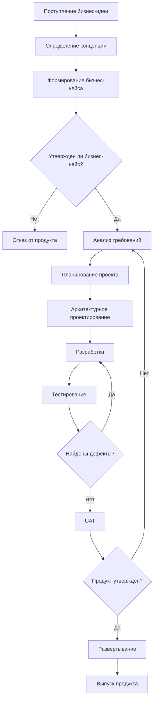

# Сравнение: BPMN vs Mermaid

Этот файл демонстрирует разницу между настоящей BPMN схемой и упрощенной диаграммой в Mermaid.

## ❌ Mermaid (простая блок-схема, НЕ BPMN)

### Проблемы Mermaid для BPMN:

1. **Нет пулов и дорожек** - не показывает, кто отвечает за какие задачи
2. **Нет потоков сообщений** - не видно взаимодействия между участниками  
3. **Упрощенные шлюзы** - нет специфики XOR/AND/OR
4. **Нет ролей и ответственности** - RACI матрица не отражена
5. **Линейный процесс** - не показывает параллельные активности

## ✅ BPMN 2.0 (product_development_process_v2.bpmn)

Настоящая BPMN схема включает:

### Пулы участников:
- Бизнес / Спонсор
- Управление Продуктом и Аналитика  
- Управление Проектом
- Разработка и Качество
- Эксплуатация и Поддержка

### Специализированные элементы:
- `<bpmn:participant>` - участники процесса
- `<bpmn:messageFlow>` - потоки сообщений между участниками
- `<bpmn:exclusiveGateway>` - XOR шлюзы для решений
- `<bpmn:parallelGateway>` - AND шлюзы для синхронизации
- `<bpmn:task>` с атрибутами ответственности

### Преимущества BPMN:
1. **Четкое разделение ответственности** по пулам
2. **Потоки сообщений** показывают коммуникацию
3. **Стандартизированная нотация** BPMN 2.0
4. **Возможность автоматизации** в BPM системах
5. **Детальная проработка** всех элементов процесса

## Вывод

Для серьезного моделирования бизнес-процессов используйте **BPMN 2.0 XML**, а Mermaid оставьте для простых диаграмм и документации.
